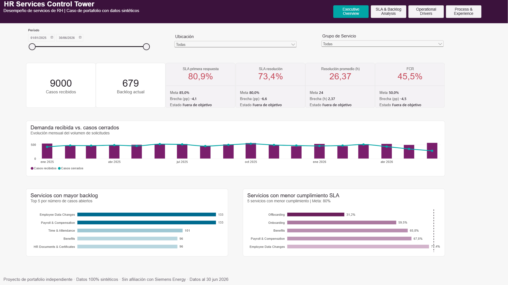
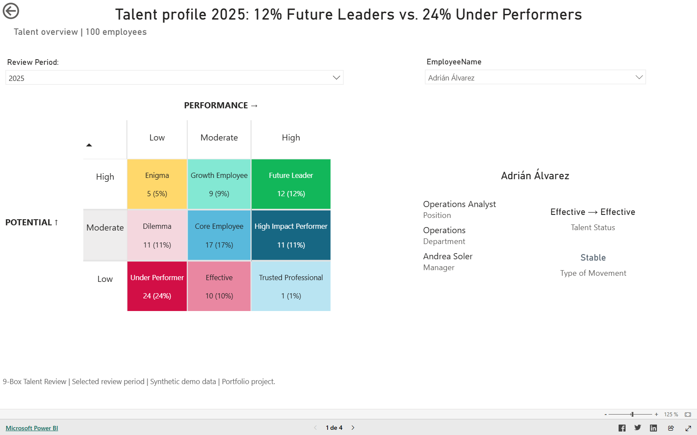

# Portafolio de People Analytics y Digital HR

Construyo productos de apoyo a decisiones que conectan procesos de Recursos Humanos, datos de la fuerza laboral y operación del negocio.

Estoy construyendo este portafolio en torno a People Analytics, HR Data, HR Services, mejora de procesos e inteligencia artificial responsable.

[English](README.md)

## Trabajo terminado

### Proyecto 1 — HR Services Control Tower

Caso end-to-end en Power BI para monitorear demanda, SLA, backlog, capacidad, calidad de proceso y experiencia del empleado mediante datos sintéticos reproducibles.

[Abrir el reporte interactivo](https://app.powerbi.com/view?r=eyJrIjoiMjU5MDEzODEtMDBkMi00MmUzLTlhNTgtMmQ4N2E1NDkyZDM2IiwidCI6ImY4NGNiMmZiLTQ0MDgtNDcxMC05NWY5LTQwYjBmMThlZDQ3ZiIsImMiOjR9) · [Explorar el caso completo](projects/hr-services-control-tower/README.es.md)

### Proyecto 0 — Talent Review & Calibration

Caso en Power BI para comprender la distribución de talento, los movimientos entre periodos, la consistencia de las evaluaciones y el riesgo departamental mediante datos sintéticos.

[Abrir el reporte interactivo](https://app.powerbi.com/view?r=eyJrIjoiMjM2NGFkZjYtOWNiNy00MWZhLWJjOGEtYzY5ZGZhZTk2N2E3IiwidCI6ImY4NGNiMmZiLTQ0MDgtNDcxMC05NWY5LTQwYjBmMThlZDQ3ZiIsImMiOjR9) · [Explorar el caso completo](projects/talent-review-calibration/README.es.md)

## Posicionamiento

Mi objetivo es desarrollarme como profesional de **HR Analytics & Digital HR**: una persona que entiende los procesos de RH y los convierte en indicadores confiables, mejores servicios y sistemas preparados para la toma de decisiones.

> Todos los datasets del portafolio son sintéticos o seguros para demostración. Los proyectos son artefactos de aprendizaje y portafolio, no sistemas productivos para tomar decisiones de RH.
