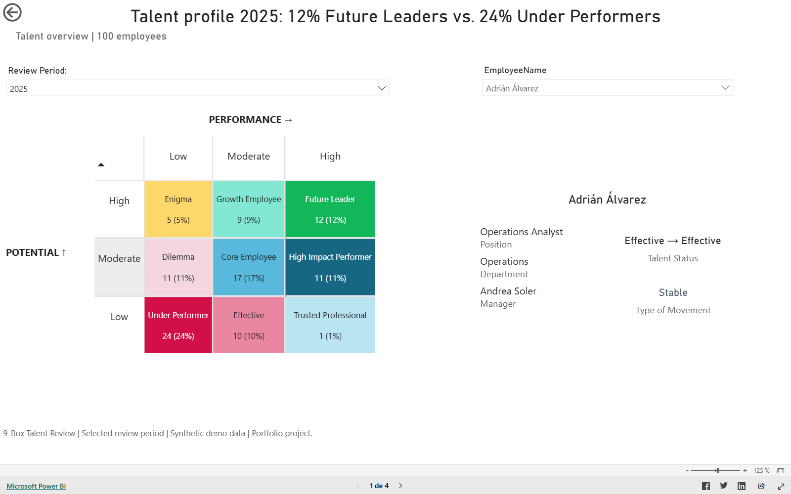

# People Analytics & Digital HR Portfolio

I build decision-support products that connect HR processes, workforce data, and business operations.

I’m building this portfolio around People Analytics, HR Data, HR Services, process improvement and responsible AI.

[Español](README.es.md)

## Completed work

### Project 0 — Talent Review & Calibration

An interactive Power BI solution for reviewing talent distribution, employee movement, manager rating patterns, and department-level talent risk.

[Open the live Power BI report](https://app.powerbi.com/view?r=eyJrIjoiMjM2NGFkZjYtOWNiNy00MWZhLWJjOGEtYzY5ZGZhZTk2N2E3IiwidCI6ImY4NGNiMmZiLTQ0MDgtNDcxMC05NWY5LTQwYjBmMThlZDQ3ZiIsImMiOjR9) · [Explore the full case study](projects/talent-review-calibration/README.md)

## Positioning

My goal is to grow as an **HR Analytics & Digital HR professional**: someone who understands people processes and turns them into reliable indicators, better services, and decision-ready systems.

> All portfolio datasets are synthetic or privacy-safe. Projects are learning and demonstration artifacts, not production HR decision systems.

