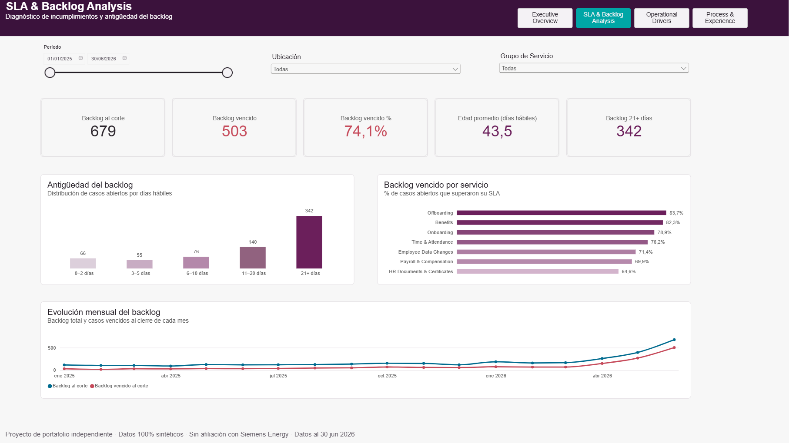
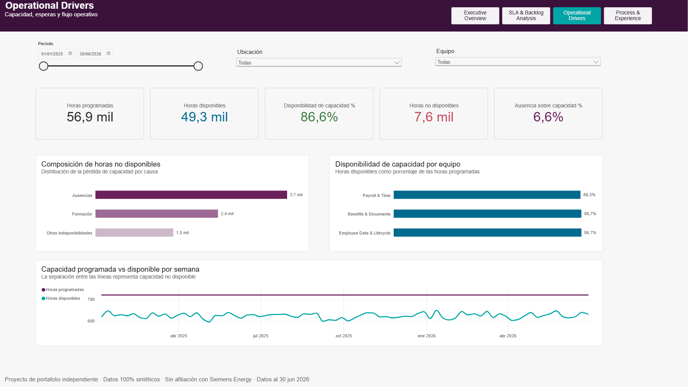
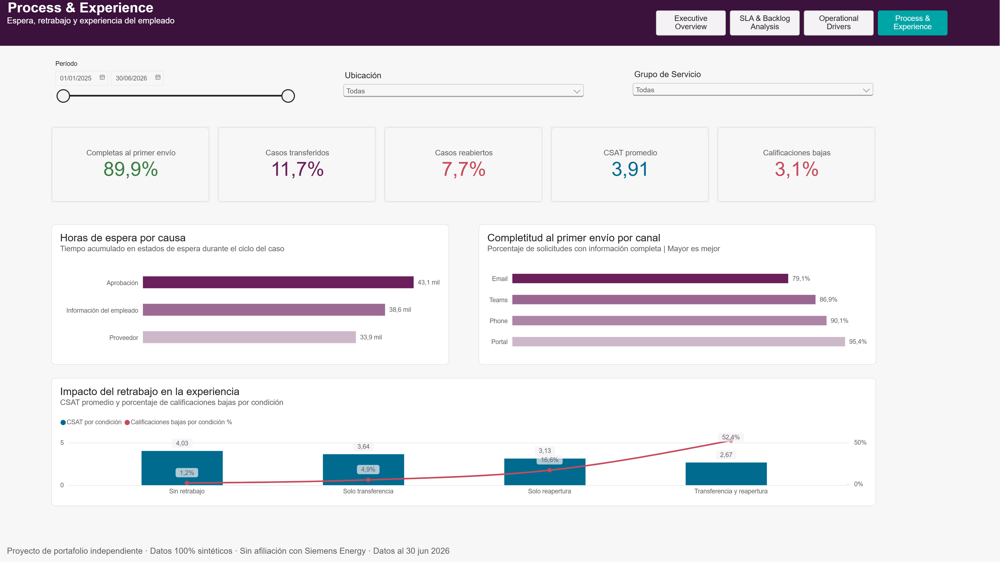

# Proyecto 1: HR Services Control Tower

Caso de portafolio en Power BI para monitorear demanda, niveles de servicio, backlog, capacidad, calidad del proceso y experiencia del empleado en una operación simulada de HR Services.

[← Volver al portafolio](../../README.es.md) · [English](README.md)

[](https://app.powerbi.com/view?r=eyJrIjoiMjU5MDEzODEtMDBkMi00MmUzLTlhNTgtMmQ4N2E1NDkyZDM2IiwidCI6ImY4NGNiMmZiLTQ0MDgtNDcxMC05NWY5LTQwYjBmMThlZDQ3ZiIsImMiOjR9)


> Proyecto independiente. El lenguaje visual se inspira en elementos públicos de la marca Siemens Energy, pero no existe afiliación ni respaldo de Siemens Energy.

## Demo interactiva

**[Abrir el reporte interactivo de Power BI](https://app.powerbi.com/view?r=eyJrIjoiMjU5MDEzODEtMDBkMi00MmUzLTlhNTgtMmQ4N2E1NDkyZDM2IiwidCI6ImY4NGNiMmZiLTQ0MDgtNDcxMC05NWY5LTQwYjBmMThlZDQ3ZiIsImMiOjR9)**

El reporte público contiene únicamente datos sintéticos.

## Qué resuelve

El reporte convierte 9,000 casos sintéticos de HR Services en cuatro vistas orientadas a decisiones. Permite responder:

- ¿La operación absorbe la demanda o crece el backlog?
- ¿Qué servicios explican los incumplimientos de SLA?
- ¿Dónde se originan las pérdidas de capacidad y las esperas?
- ¿Cómo se relacionan las solicitudes incompletas y el retrabajo con la experiencia?

## Páginas del reporte

### Executive Overview

Demanda, backlog, SLA, tiempo de resolución y resolución en primer contacto.


### SLA & Backlog Analysis

Trabajo vencido, antigüedad del backlog, riesgo por servicio y evolución mensual.



### Operational Drivers

Horas programadas, capacidad disponible, causas de pérdida y tendencia semanal.



### Process & Experience

Tiempos de espera, completitud, retrabajo, CSAT y riesgo de calificaciones bajas.



## Metodología en lenguaje sencillo

1. Un generador en Python crea datos reproducibles y 100% sintéticos de casos, eventos, encuestas, backlog y capacidad.
2. Power Query valida tipos de dato y prepara las tablas analíticas.
3. Un modelo tipo estrella conecta las dimensiones compartidas —fecha, servicio, ubicación y equipo— con las tablas de hechos.
4. Las medidas DAX calculan los indicadores según los filtros seleccionados.
5. Pruebas automáticas y validaciones contra los CSV comprueban conteos, llaves, reglas de negocio y hallazgos.

### Términos de HR Services

| Término | Significado sencillo |
|---|---|
| SLA | Tiempo acordado para responder o resolver una solicitud |
| Backlog | Casos que continúan abiertos en una fecha determinada |
| Backlog vencido | Casos abiertos que ya superaron su tiempo objetivo de resolución |
| FCR | Casos resueltos en el primer contacto, sin transferencia ni reapertura |
| Retrabajo | Trabajo adicional causado por transferir o reabrir un caso |
| CSAT | Promedio de satisfacción en una escala de 1 a 5 |
| Disponibilidad de capacidad | Horas disponibles entre horas programadas |

## Hallazgos principales

- Al corte existen **679 casos abiertos**; **503 (74.1%)** están vencidos.
- **Offboarding** tiene el menor cumplimiento de SLA de resolución: **31.2%**.
- La disponibilidad de capacidad es **86.6%**; las ausencias representan **6.6%** de las horas programadas.
- La completitud va de **79.1% en Email** a **95.4% en Portal**.
- Los casos sin transferencia ni reapertura promedian **4.03 de CSAT**. Los casos con ambas condiciones promedian **2.67**, pero este último segmento contiene solo **21 encuestas** y debe interpretarse con cautela.

Son patrones diseñados en datos sintéticos, no afirmaciones sobre una organización real.

## Acciones recomendadas

1. Priorizar el backlog vencido de Offboarding y Onboarding.
2. Estandarizar la entrada por Email y orientar a los empleados hacia Portal.
3. Monitorear casos transferidos y reabiertos como una cola de calidad e interpretar la experiencia junto con su tamaño de muestra.

## Archivos y documentación

- [Reporte de Power BI](power-bi/Project-1-HR-Services-Control-Tower.pbix)
- [Tablas analíticas procesadas](data/processed/)
- [Exportaciones sintéticas raw](data/raw/)
- [Diccionario de datos](docs/data-dictionary.es.md)
- [Diseño de datos sintéticos](docs/synthetic-data-design.es.md)
- [Guía de Power BI](docs/power-bi-fast-track.es.md)
- [Tema de Power BI](assets/power-bi/siemens-energy-inspired-theme.json)

Para regenerar los datos:

```powershell
.\scripts\run_generator.ps1
```

## Uso responsable

- Todas las personas, casos, ubicaciones, fechas y encuestas son sintéticas.
- El dashboard evalúa procesos de servicio, no el desempeño individual de empleados o agentes.
- Las muestras pequeñas pueden producir porcentajes inestables; el tooltip correspondiente muestra el número de encuestas.
- Las asociaciones diseñadas demuestran un análisis, pero no prueban causalidad.

## Autor

Miguel — [Perfil de GitHub](https://github.com/MiguelPR-99)
