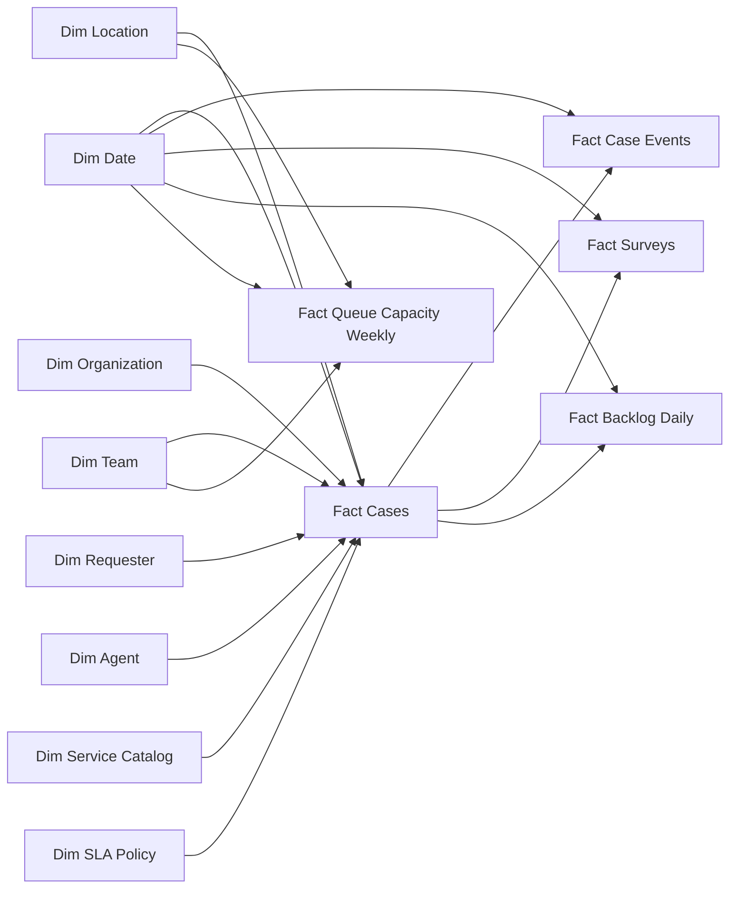

# Diseño de datos sintéticos

## 1. Objetivo del dataset

Crear un conjunto de datos reproducible y suficientemente realista para construir un **HR Services / Service Delivery Control Tower** en Power BI. El dataset debe permitir analizar demanda, capacidad, flujo de trabajo, SLA, backlog, retrabajo y experiencia del empleado sin contener información personal real.

El diseño separa tres conceptos:

- **Datos maestros:** solicitantes anónimos, agentes ficticios, ubicaciones, unidades y catálogo de servicios.
- **Datos transaccionales:** casos, eventos de estado, encuestas y capacidad semanal.
- **Datos derivados:** snapshots diarios de backlog, duraciones en horas hábiles y banderas de KPI.

## 2. Parámetros de la simulación

| Parámetro | Diseño aprobado |
|---|---:|
| Periodo | 1 enero 2025–30 junio 2026 |
| Fecha de corte | 30 junio 2026, 23:59 |
| Semilla aleatoria | `20260824` |
| Solicitantes anónimos | 1,200 |
| Agentes ficticios | 18 |
| Equipos de HR Services | 3 |
| Ubicaciones atendidas | 3 |
| Unidades organizacionales | 7 |
| Casos objetivo | 9,000 |
| Tipos de solicitud | 21 |
| Prioridades | 4 |
| Canales | 4 |
| Horario de servicio | lunes–viernes, 08:00–16:00 |
| Unidad de SLA | horas hábiles |

Las fechas, nombres y volúmenes son parte de una empresa ficticia. No se utilizarán nombres, correos, teléfonos, direcciones, salarios, texto libre, información médica ni otros datos sensibles.

## 3. Capas de datos

```text
data/raw/          Exportaciones sintéticas con problemas controlados
        │
        ▼
Power Query        Tipos, homologación, deduplicación, joins y cuarentena
        │
        ▼
data/processed/    Tablas limpias de referencia para validar Power BI
        │
        ▼
Modelo semántico   Dimensiones conformadas + hechos + medidas DAX
```

Los archivos `raw` serán la entrada principal de Power BI. La capa `processed` permitirá comprobar que las transformaciones producen los resultados esperados; no sustituirá el trabajo de Power Query.

## 4. Tablas y volumen esperado

| Tabla | Grano | Filas esperadas | Uso |
|---|---|---:|---|
| `dim_date` | Una fecha | 546 | Calendario y días hábiles |
| `dim_location` | Una ubicación | 3 | Segmentación geográfica ficticia |
| `dim_organization` | Una unidad | 7 | Contexto del solicitante |
| `dim_team` | Un equipo de HR Services | 3 | Propiedad de colas y capacidad |
| `dim_requester` | Un solicitante anónimo | 1,200 | Usuarios atendidos y contactos repetidos |
| `dim_agent` | Un agente ficticio | 18 | Carga y asignación operativa |
| `dim_service_catalog` | Un tipo de solicitud | 21 | Servicio, complejidad y reglas operativas |
| `dim_sla_policy` | Una prioridad | 4 | Metas de primera respuesta y resolución |
| `fact_cases` | Un caso | 9,000 | Hecho central del Control Tower |
| `fact_case_events` | Un cambio de estado | 42,000–55,000 | Flujo, espera, transferencias y reaperturas |
| `fact_surveys` | Una respuesta a encuesta | 2,500–3,200 | Satisfacción y facilidad |
| `fact_backlog_daily` | Un caso abierto al cierre de un día | 55,000–100,000 | Backlog histórico y antigüedad |
| `fact_queue_capacity_weekly` | Un equipo–ubicación–semana | 711 | Capacidad disponible y explicación del backlog |

## 5. Dimensiones maestras

### Ubicaciones

1. Planta Bajío.
2. Centro de Servicios Querétaro.
3. Oficinas Ciudad de México.

### Unidades organizacionales

1. Manufacturing.
2. Engineering.
3. Service Operations.
4. Supply Chain.
5. Sales.
6. Finance.
7. Corporate Functions.

### Equipos de HR Services

1. Payroll & Time.
2. Benefits & Documents.
3. Employee Data & Lifecycle.

Cada agente tendrá un alias ficticio, un equipo principal, una ubicación de trabajo y una banda de experiencia. Los alias sirven para demostrar operaciones; el reporte no se utilizará para calificar ni ordenar personas por desempeño.

### Catálogo de servicios

| Grupo | Tipos de solicitud |
|---|---|
| Payroll & Compensation | Payslip Clarification; Payment Discrepancy; Bank or Tax Data |
| Benefits | Enrollment or Change; Dependent Update; Vendor Inquiry |
| Time & Attendance | Time Correction; Absence or Leave Registration; Overtime Query |
| Employee Data Changes | Personal or Contact Data; Emergency or Dependent Data; Position or Location Data |
| HR Documents & Certificates | Employment Certificate; Reference or Confirmation Letter; Document Copy |
| Onboarding | Pre-hire Documents; HR System Setup; Orientation Support |
| Offboarding | Termination Documents; Final Pay Coordination; Asset or Access Clearance |

Cada tipo tendrá equipo propietario, complejidad base, probabilidad de aprobación, dependencia externa y prioridad predeterminada.

## 6. Política de SLA

El reloj se contará únicamente dentro del horario sintético de servicio. Fines de semana y fechas marcadas como no laborables no consumen SLA.

| Prioridad | Primera respuesta | Resolución | Uso ilustrativo |
|---|---:|---:|---|
| Critical | 2 h | 8 h | Riesgo inmediato para pago, acceso o salida |
| High | 4 h | 16 h | Impacto operativo o fecha límite cercana |
| Standard | 8 h | 40 h | Solicitud ordinaria |
| Low | 16 h | 80 h | Consulta o documento no urgente |

Distribución objetivo: 1% Critical, 11% High, 54% Standard y 34% Low. El tipo de solicitud modificará esta probabilidad; por ejemplo, una discrepancia de pago tendrá más casos High que una copia documental.

## 7. Ciclo de vida del caso

Estados posibles:

```text
Submitted → Assigned → In Progress → Resolved → Closed
                         │     │
                         │     ├─ Waiting for Employee
                         │     ├─ Waiting for Approval
                         │     └─ Waiting for Vendor
                         │
                         ├─ Transferred → In Progress
                         └─ Resolved → Reopened → In Progress
```

Reglas:

- Todo caso inicia con `Submitted`.
- Un caso no cancelado debe tener asignación.
- La primera respuesta nunca puede ocurrir antes de la creación.
- Los eventos deben conservar orden temporal.
- Un caso abierto no tiene fecha final de cierre.
- Un caso reabierto debe haber tenido un evento `Resolved` anterior.
- Las transferencias cambian al menos una vez de agente o equipo.
- Las esperas conservarán razón y duración, pero no texto libre.

## 8. Distribuciones base

### Canal

| Canal | Participación objetivo | Solicitud incompleta objetivo |
|---|---:|---:|
| Portal | 55% | 5% |
| Email | 25% | 22% |
| Teams | 12% | 12% |
| Phone | 8% | 10% |

### Resultado operativo

| Resultado | Rango objetivo |
|---|---:|
| Casos cerrados o resueltos al corte | 88–92% |
| Casos abiertos al corte | 7–10% |
| Casos cancelados | 1–2% |
| Transferencia de equipo/agente | 10–15% |
| Reapertura | 6–10% |
| Resuelto en primer contacto | 60–72% |
| Invitación a encuesta sobre cierres elegibles | 70% |
| Respuesta entre invitados | 42–50% |

Estos son controles de simulación, no benchmarks reales de HR Services.

## 9. Patrones narrativos controlados

Los patrones se implantarán mediante reglas explícitas y después se probarán estadísticamente.

### P1. Demanda de nómina al cierre de mes

- Entre el día 26 y el día 3 del mes siguiente, la tasa de llegada de Payroll & Compensation aumentará entre 50% y 70%.
- El resto de los servicios conservará su estacionalidad base.
- Resultado esperado: picos mensuales visibles sin que todos los servicios se comporten igual.

### P2. Calidad de entrada por canal

- Email tendrá aproximadamente cuatro veces la proporción de solicitudes incompletas del portal.
- Los casos incompletos añadirán espera por empleado y reducirán la probabilidad de resolución en primer contacto.
- Resultado esperado: el canal explica parte del retrabajo, pero no determina por sí solo el resultado.

### P3. Dependencia externa en beneficios

- Entre abril y junio de 2025, `Vendor Inquiry` y `Dependent Update` tendrán mayor probabilidad y duración de `Waiting for Vendor`.
- Resultado esperado: caída temporal del SLA de Benefits y aumento de P90, seguida de recuperación.

### P4. Demanda y capacidad en Planta Bajío

- Durante septiembre y octubre de 2025, las colas de Planta Bajío recibirán cerca de 30% más casos.
- La capacidad disponible de Employee Data & Lifecycle para esa ubicación disminuirá cerca de 20% durante seis semanas.
- Resultado esperado: aumento de backlog y antigüedad, con recuperación gradual en noviembre y diciembre.

### P5. Estandarización de Employee Data Changes

- Fecha de intervención hipotética: 1 enero 2026.
- Para solicitudes ingresadas por portal, la probabilidad de información incompleta disminuirá 55% respecto al periodo previo.
- La mediana de tiempo activo disminuirá aproximadamente 20%, controlando complejidad.
- Resultado esperado: mejora gradual de resolución en primer contacto y SLA; se describirá como asociación simulada, no como causalidad real.

### P6. Experiencia del empleado

- El puntaje base se generará alrededor de 4.2/5.
- Incumplir SLA, transferir o reabrir un caso aplicará penalizaciones probabilísticas diferentes.
- Una reapertura tendrá mayor impacto esperado que una transferencia.
- Se añadirá ruido suficiente para evitar relaciones perfectas.

## 10. Problemas deliberados en la capa raw

| Problema | Tasa objetivo | Tratamiento esperado |
|---|---:|---|
| Filas duplicadas exactas en casos | 0.8% | Deduplicar por `CaseID` y marca de extracción |
| Variantes de canal o servicio | 1.5% | Homologar mediante tabla de mapeo |
| Canal vacío | 0.5% | Clasificar como `Unknown` y reportar |
| Espacios al inicio/final | 1.0% | Aplicar limpieza de texto |
| Booleanos con `Y/N`, `TRUE/FALSE` o `1/0` | 2.0% | Convertir a tipo lógico único |
| Eventos duplicados | 0.5% | Deduplicar por caso, secuencia y timestamp |
| Encuestas huérfanas | 0.3% | Enviar a cuarentena; no incorporar al modelo |

No se introducirán fechas imposibles o montos sensibles. La dificultad debe demostrar limpieza y control, no obligar a inventar correcciones sin evidencia.

## 11. Modelo analítico



`Fact Cases` conservará las claves de ubicación y unidad del solicitante al momento de crear el caso. Esto evita que un cambio posterior de ubicación reescriba artificialmente el historial.

## 12. KPIs que el diseño debe soportar

- Casos recibidos y cerrados.
- Flujo neto: recibidos menos cerrados.
- Backlog al cierre de cada día.
- Antigüedad del backlog: 0–2, 3–5, 6–10, 11–20 y 21+ días hábiles.
- Cumplimiento de SLA de primera respuesta.
- Cumplimiento de SLA de resolución.
- Tiempo promedio, mediano y percentil 90 de resolución.
- Resolución en primer contacto.
- Tasa de reapertura.
- Tasa de transferencia.
- Solicitudes completas al primer envío.
- CSAT promedio, porcentaje de calificaciones bajas y tasa de respuesta.
- Casos recibidos por cada 100 solicitantes.
- Capacidad disponible por cola y semana.

Los denominadores, exclusiones y campos fuente se fijarán en el diccionario de métricas durante la fase de modelo; el dataset ya contendrá las claves y timestamps necesarios para recalcularlos.

## 13. Pruebas de aceptación del dataset

### Integridad

- `CaseID` único en la capa procesada.
- Todas las claves foráneas existen.
- Eventos ordenados y con secuencia única dentro de cada caso.
- Encuestas solamente para casos cerrados elegibles.
- Puntajes dentro de 1–5.

### Lógica temporal

- `CreatedAt <= FirstResponseAt <= ResolvedAt <= ClosedAt` cuando los campos apliquen.
- Ninguna duración hábil es negativa.
- Un caso abierto al corte no tiene `ClosedAt`.
- Un snapshot no existe antes de la creación ni después del cierre.

### Reconciliación

- Casos recibidos en el periodo = filas únicas de `fact_cases`.
- Backlog final calculado desde casos = backlog del snapshot al 30 junio 2026.
- Respuestas de encuesta válidas = filas de `fact_surveys` después de cuarentena.
- Eventos de transferencia y reapertura concuerdan con los contadores de `fact_cases`.

### Patrones controlados

- Payroll presenta el pico esperado en la ventana de cierre mensual.
- Email tiene mayor incompletitud que Portal.
- Benefits empeora durante el evento de proveedor y se recupera después.
- Planta Bajío acumula backlog durante el evento de demanda/capacidad.
- Employee Data Changes por portal mejora después del 1 enero 2026.
- CSAT es menor, en promedio, cuando existe reapertura o incumplimiento de SLA.

## 14. Orden de generación

1. Crear calendario, ubicaciones, unidades, catálogo, SLA y equipos.
2. Crear solicitantes y agentes ficticios.
3. Distribuir 9,000 llegadas en el tiempo según estacionalidad.
4. Asignar servicio, canal, ubicación, prioridad y complejidad.
5. Generar proceso, esperas, respuestas, resolución y estado al corte.
6. Construir el event log desde el proceso generado.
7. Generar invitaciones y respuestas de encuesta.
8. Expandir casos abiertos por día para crear snapshots.
9. Generar capacidad semanal por cola.
10. Crear capa limpia de referencia.
11. Inyectar problemas controlados exclusivamente en la capa raw.
12. Ejecutar pruebas y producir un reporte de validación.
