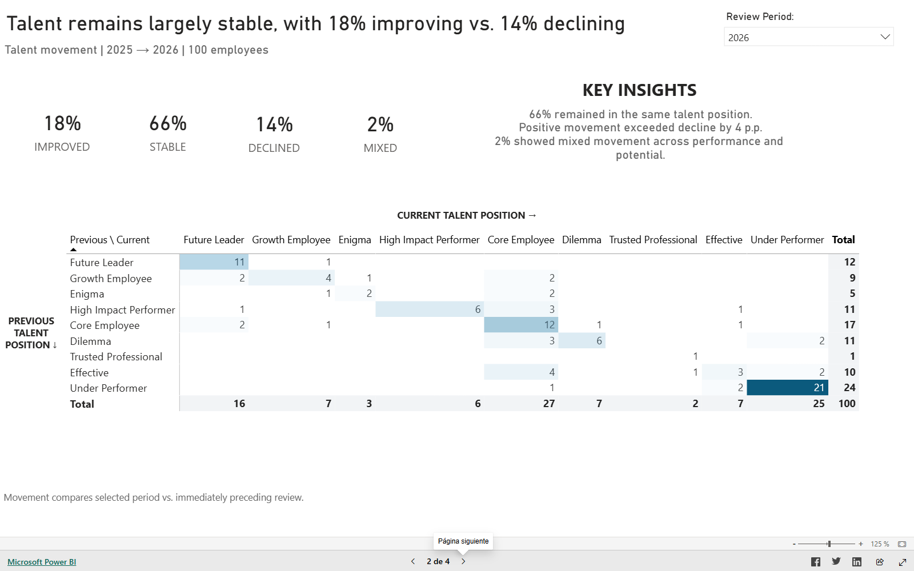
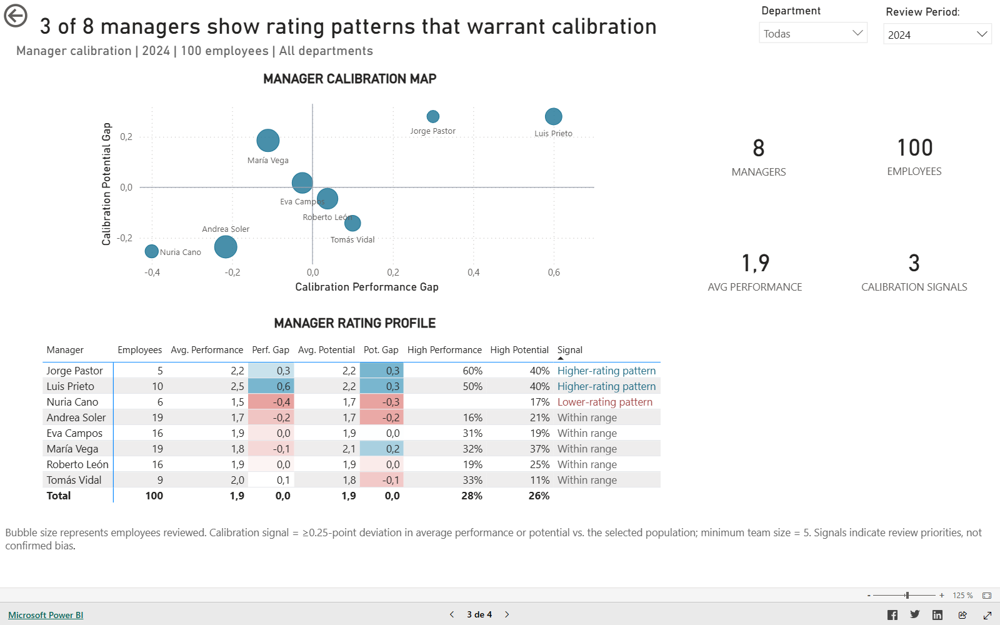
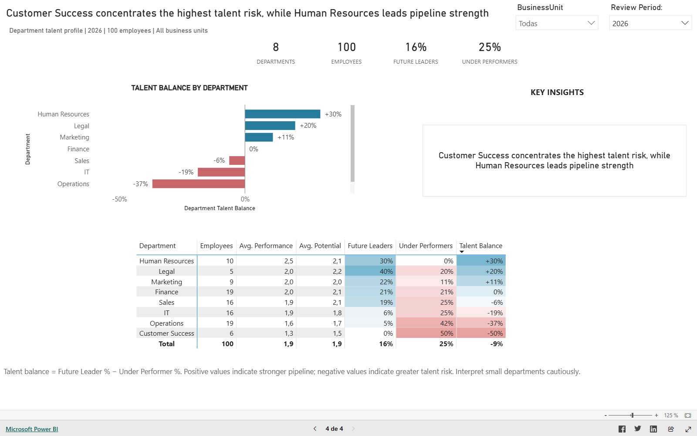
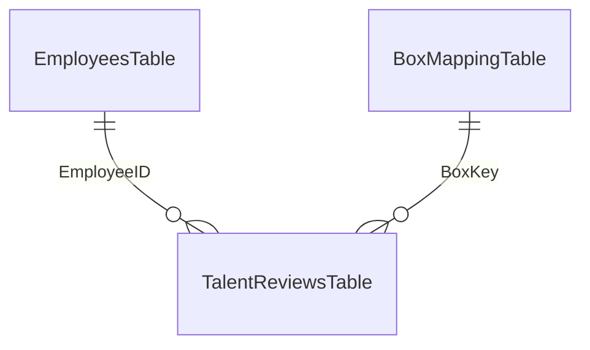

# Proyecto 0: Talent Review & Calibration

Caso interactivo de People Analytics desarrollado en Power BI para apoyar conversaciones de talento mediante una matriz 9-box, movimientos entre periodos, señales de calibración por manager y riesgo departamental.

[← Volver al portafolio](../../README.es.md) · [English](README.md)

## Resumen ejecutivo

El proyecto convierte evaluaciones anuales de talento en cuatro vistas orientadas a decisiones:

1. Distribución actual 9-box y contexto del empleado seleccionado.
2. Movimiento entre posiciones de talento a través de los periodos.
3. Patrones de evaluación de managers que ameritan una conversación de calibración.
4. Fortaleza del pipeline y concentración de riesgo por departamento.

La solución está dirigida a HR Business Partners, Talent Management y People Analytics. Apoya una revisión estructurada; no automatiza decisiones laborales.

## Demo

**[Abrir el reporte interactivo de Power BI](https://app.powerbi.com/view?r=eyJrIjoiMjM2NGFkZjYtOWNiNy00MWZhLWJjOGEtYzY5ZGZhZTk2N2E3IiwidCI6ImY4NGNiMmZiLTQ0MDgtNDcxMC05NWY5LTQwYjBmMThlZDQ3ZiIsImMiOjR9)**

El reporte puede publicarse de forma abierta porque todos los datos y nombres son sintéticos.

## Preguntas de negocio

- ¿Cómo se distribuye el talento entre niveles de desempeño y potencial?
- ¿Quién mejoró, permaneció estable, retrocedió o tuvo un movimiento mixto?
- ¿Qué patrones de evaluación deberían revisarse durante la calibración?
- ¿Qué departamentos tienen el pipeline más fuerte o la mayor concentración de riesgo?

## Páginas del reporte

### 1. Talent Overview

Matriz 9-box interactiva con selección de periodo y contexto del empleado.

### 2. Talent Movement

Matriz de transición que compara el periodo seleccionado con la evaluación inmediatamente anterior.

### 3. Calibration & Managers

Comparación de managers mediante brechas de desempeño y potencial contra la población seleccionada. El tamaño de la burbuja representa empleados evaluados.

### 4. Department Analysis

Comparación departamental mediante Talent Balance: porcentaje de Future Leaders menos porcentaje de Under Performers.

## Hallazgos del dataset demo

- En 2025, 12% de los empleados son Future Leaders y 24% son Under Performers.
- De 2025 a 2026, 66% permaneció estable, 18% mejoró, 14% retrocedió y 2% tuvo movimiento mixto.
- Tres de ocho managers cumplen la regla para revisión de calibración en el ejemplo de 2024.
- En 2026, Human Resources tiene el Talent Balance más fuerte (+30 p.p.) y Customer Success concentra el mayor riesgo (-50 p.p.).

## Acciones recomendadas

1. Priorizar revisiones estructuradas en Customer Success y Operations.
2. Discutir los tres patrones señalados antes de interpretarlos como sesgo.
3. Crear planes de desarrollo y movilidad para el pipeline de liderazgo y monitorear el riesgo departamental.

## Definiciones principales

| KPI | Definición |
|---|---|
| Future Leader % | Empleados con alto desempeño y alto potencial entre empleados evaluados |
| Under Performer % | Empleados con bajo desempeño y bajo potencial entre empleados evaluados |
| Talent Balance | Future Leader % menos Under Performer % |
| Improved | Movimiento neto positivo en desempeño y/o potencial |
| Stable | Misma posición 9-box que en la evaluación anterior |
| Declined | Movimiento neto negativo en desempeño y/o potencial |
| Mixed | Desempeño y potencial se movieron en direcciones opuestas |
| Calibration Gap | Promedio del manager menos promedio de la población seleccionada |
| Calibration Signal | Brecha absoluta de al menos 0.25 puntos en desempeño o potencial y equipo mínimo de cinco personas |

Consulta el [diccionario completo de métricas](docs/metric-dictionary.md).

## Modelo de datos

Las medidas están centralizadas en una tabla `_Measures` y organizadas por propósito analítico. Las relaciones permanecen en una sola dirección para mantener un comportamiento de filtrado explícito.

Consulta las [notas del modelo e implementación](docs/data-model.md).

## Herramientas y técnicas

- Power BI Desktop y Power BI Service
- Power Query para preparación de datos
- DAX para medidas dependientes del contexto, titulares dinámicos, transiciones y calibración
- Modelo estrella con dimensiones explícitas
- Formato condicional y jerarquía visual ejecutiva
- Diseño de interacciones para filtros, empleado y exploración 9-box

## Archivos

- [Archivo de Power BI](power-bi/Project-0-Talent-Review-Calibration.pbix)
- [Dataset sintético](data/9box_powerbi_dataset_demo.xlsx)

## Uso responsable y limitaciones

- Todos los registros y nombres son sintéticos.
- La matriz 9-box simplifica conversaciones complejas de desempeño y potencial.
- Las señales de calibración indican prioridades de revisión, no sesgo confirmado ni calidad del manager.
- Los departamentos y equipos pequeños deben interpretarse con cautela.
- El dashboard debe complementar procesos documentados y revisión humana, no tomar decisiones automáticas.

Consulta la declaración completa de [uso responsable](docs/responsible-use.md).

## Nota de desarrollo

Se utilizaron herramientas de IA como apoyo de diseño y depuración. Las reglas de negocio, cálculos, interacciones y resultados se revisaron y validaron manualmente contra los datos sintéticos.

## Autor

Miguel — [Perfil de GitHub](https://github.com/MiguelPR-99)
