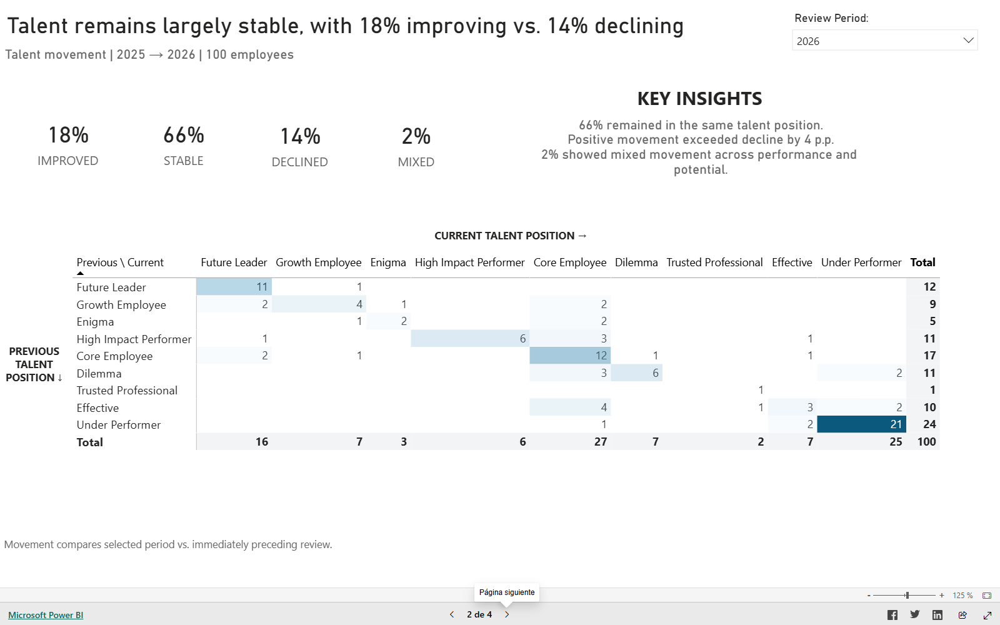
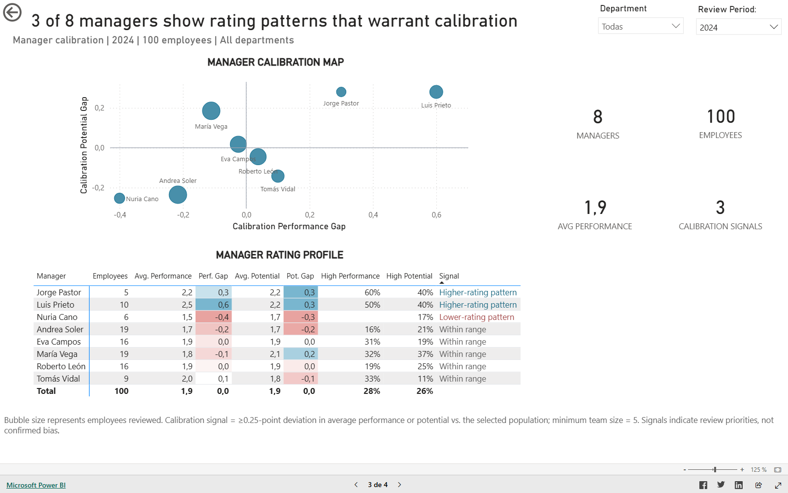
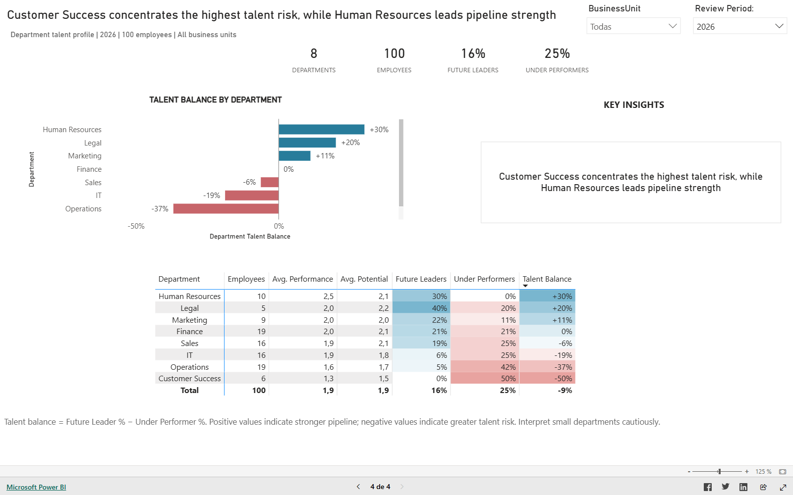

# Proyecto 0: Talent Review & Calibration

Caso de portafolio en Power BI para comprender la distribución de talento, los movimientos entre periodos, la consistencia de las evaluaciones y el riesgo por departamento.

[← Volver al portafolio](../../README.es.md) · [English](README.md)

> Demostración de portafolio con empleados y evaluaciones sintéticas. El reporte apoya conversaciones estructuradas; no automatiza decisiones laborales.

## Demo interactiva

**[Abrir el reporte interactivo de Power BI](https://app.powerbi.com/view?r=eyJrIjoiMjM2NGFkZjYtOWNiNy00MWZhLWJjOGEtYzY5ZGZhZTk2N2E3IiwidCI6ImY4NGNiMmZiLTQ0MDgtNDcxMC05NWY5LTQwYjBmMThlZDQ3ZiIsImMiOjR9)**

El reporte público contiene únicamente datos sintéticos.

## Qué resuelve

El reporte convierte las evaluaciones anuales de 100 empleados sintéticos en cuatro vistas orientadas a decisiones. Permite responder:

- ¿Cómo se distribuye el talento entre niveles de desempeño y potencial?
- ¿La posición general del talento mejora, permanece estable o retrocede?
- ¿Qué patrones de evaluación requieren una conversación de calibración?
- ¿Qué departamentos muestran un pipeline de liderazgo más fuerte o mayor riesgo de talento?

## Páginas del reporte

### Talent Overview

Matriz 9-box interactiva con el periodo seleccionado y contexto breve del empleado.

### Talent Movement

Movimiento entre el periodo seleccionado y la evaluación inmediatamente anterior.

### Calibration & Managers

Comparación de patrones de evaluación contra la población seleccionada. El tamaño de la burbuja representa empleados evaluados.

### Department Analysis

Comparación de la fortaleza del pipeline de liderazgo y la concentración de riesgo por departamento.

## Metodología en lenguaje sencillo

1. Un archivo sintético reúne información de empleados, evaluaciones anuales y la clasificación 9-box.
2. Power Query prepara las tablas y valida los tipos de dato.
3. Un modelo tipo estrella conecta empleados y posiciones de talento con las evaluaciones anuales.
4. Las medidas DAX calculan distribución, movimiento, calibración e indicadores departamentales según los filtros seleccionados.
5. Las medidas y los resultados publicados se validan directamente contra los datos sintéticos de origen.

### Términos de Talent Review

| Término | Significado sencillo |
|---|---|
| Matriz 9-box | Marco que combina tres niveles de desempeño con tres niveles de potencial |
| Desempeño | Evaluación de resultados y comportamientos durante el periodo |
| Potencial | Valoración organizacional sobre la preparación para asumir responsabilidades más amplias o complejas |
| Future Leader | Posición 9-box con desempeño alto y potencial alto |
| Under Performer | Posición 9-box con desempeño bajo y potencial bajo |
| Movimiento | Cambio de posición 9-box respecto a la evaluación anterior |
| Calibración | Conversación estructurada para aplicar criterios de evaluación con mayor consistencia entre equipos |
| Señal de calibración | Patrón que debe revisarse; no demuestra sesgo ni calidad del manager |
| Talent Balance | Porcentaje de Future Leaders menos porcentaje de Under Performers |

## Hallazgos principales

- En 2025, **12%** de los empleados son Future Leaders y **24%** son Under Performers.
- De 2025 a 2026, **66%** permaneció estable, **18%** mejoró, **14%** retrocedió y **2%** tuvo movimiento mixto.
- En el ejemplo de 2024, **3 de 8 managers** cumplen la regla para una revisión de calibración.
- En 2026, Human Resources tiene el Talent Balance más fuerte (**+30 puntos porcentuales**) y Customer Success el más bajo (**−50 puntos porcentuales**).

Son patrones diseñados en datos sintéticos, no afirmaciones sobre una organización real.

## Acciones recomendadas

1. Priorizar revisiones estructuradas en Customer Success y Operations.
2. Analizar los patrones señalados durante la calibración antes de concluir que existe sesgo o un problema de calidad del manager.
3. Crear planes de desarrollo y movilidad para el pipeline de liderazgo, considerando el tamaño y contexto de cada departamento.

## Archivos y documentación

- [Reporte de Power BI](power-bi/Project-0-Talent-Review-Calibration.pbix)
- [Dataset sintético](data/9box_powerbi_dataset_demo.xlsx)
- [Diccionario de métricas](docs/metric-dictionary.md)
- [Modelo de datos y notas de implementación](docs/data-model.md)
- [Declaración de uso responsable](docs/responsible-use.md)

## Uso responsable

- Todos los empleados, nombres, asignaciones y evaluaciones son sintéticos.
- La matriz 9-box simplifica conversaciones complejas sobre desempeño y potencial.
- Las señales de calibración identifican prioridades de revisión, no sesgo confirmado.
- Los grupos pequeños pueden producir porcentajes inestables y requieren contexto organizacional.
- El dashboard apoya la revisión humana; no debe decidir promociones, compensación, sucesión o terminaciones laborales.

## Autor

Miguel — [Perfil de GitHub](https://github.com/MiguelPR-99)
