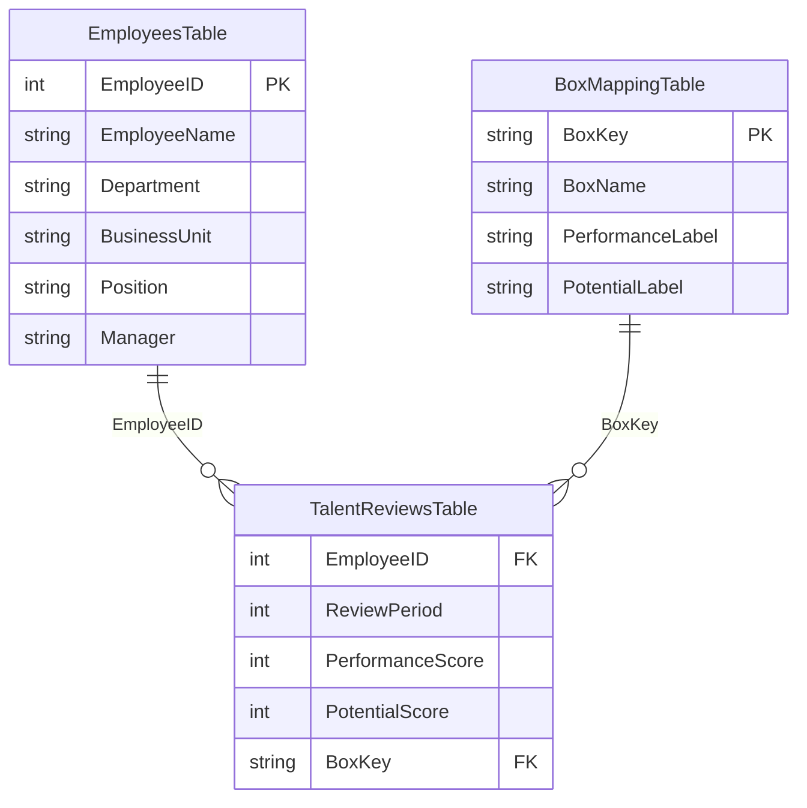

# Project 0: Talent Review & Calibration

An interactive People Analytics case study built in Power BI to support talent-review conversations with a 9-box matrix, year-over-year movement, manager calibration signals, and department-level talent risk.

[← Back to portfolio](../../README.md) · [Español](README.es.md)

[](https://app.powerbi.com/view?r=eyJrIjoiMjM2NGFkZjYtOWNiNy00MWZhLWJjOGEtYzY5ZGZhZTk2N2E3IiwidCI6ImY4NGNiMmZiLTQ0MDgtNDcxMC05NWY5LTQwYjBmMThlZDQ3ZiIsImMiOjR9)


## Executive summary

The project converts annual talent-review records into four decision-oriented views:

1. Current 9-box talent distribution and selected employee context.
2. Movement between talent positions across review periods.
3. Manager rating patterns that warrant calibration discussion.
4. Department-level pipeline strength and talent-risk concentration.

The solution is designed for HR Business Partners, Talent Management, and People Analytics teams. It supports structured review; it does not automate employment decisions.

## Live demo

**[Open the interactive Power BI report](https://app.powerbi.com/view?r=eyJrIjoiMjM2NGFkZjYtOWNiNy00MWZhLWJjOGEtYzY5ZGZhZTk2N2E3IiwidCI6ImY4NGNiMmZiLTQ0MDgtNDcxMC05NWY5LTQwYjBmMThlZDQ3ZiIsImMiOjR9)**

The report is published publicly because all employee and review data are synthetic.

## Business questions

- How is talent distributed across performance and potential levels?
- Who moved to a stronger, stable, weaker, or mixed talent position?
- Which manager rating patterns should be discussed during calibration?
- Which departments have the strongest leadership pipeline or greatest talent-risk concentration?

## Report pages

### 1. Talent Overview

Interactive 9-box matrix with review-period selection and employee context.


### 2. Talent Movement

Transition matrix comparing each selected review period with the immediately preceding period.


### 3. Calibration & Managers

Manager comparison based on average performance and potential gaps against the selected population. Bubble size represents employees reviewed.


### 4. Department Analysis

Department comparison using talent balance: Future Leader percentage minus Under Performer percentage.


## Selected findings from the demo data

- In the 2025 overview, 12% of employees are Future Leaders and 24% are Under Performers.
- From 2025 to 2026, 66% remained stable, 18% improved, 14% declined, and 2% showed mixed movement.
- Three of eight managers meet the calibration-review rule in the 2024 example.
- In 2026, Human Resources has the strongest talent balance (+30 p.p.), while Customer Success has the highest risk concentration (-50 p.p.).

## Recommended actions

1. Prioritize structured talent reviews in Customer Success and Operations.
2. Discuss the three flagged manager patterns during calibration before interpreting them as bias.
3. Build development and mobility plans for leadership-pipeline employees while monitoring department-level risk over time.

## KPI definitions

| KPI | Definition |
|---|---|
| Future Leader % | Employees in the high-performance/high-potential box divided by reviewed employees |
| Under Performer % | Employees in the low-performance/low-potential box divided by reviewed employees |
| Talent Balance | Future Leader % minus Under Performer % |
| Improved | Positive net movement across performance and/or potential |
| Stable | Same 9-box talent position as the prior review |
| Declined | Negative net movement across performance and/or potential |
| Mixed | Performance and potential moved in opposite directions |
| Calibration Gap | Manager average minus selected-population average |
| Calibration Signal | Absolute performance or potential gap of at least 0.25 points, with a minimum team size of five |

See the complete [metric dictionary](docs/metric-dictionary.md).

## Data model



Measures are centralized in a dedicated `_Measures` table and organized by analytical purpose. Relationships remain single-direction to keep filtering behavior explicit.

See [data model and implementation notes](docs/data-model.md).

## Tools and techniques

- Power BI Desktop and Power BI Service
- Power Query for data preparation
- DAX for context-aware measures, dynamic headlines, transitions, and calibration logic
- Star-schema modeling with explicit mapping dimensions
- Conditional formatting and executive-style visual hierarchy
- Interaction design for slicers, employee context, and 9-box exploration

## Monorepo structure

```text
people-analytics-portfolio/
  README.md
  README.es.md
  projects/
    talent-review-calibration/
      README.md
      README.es.md
      assets/
      data/
      docs/
      power-bi/
```

## Download files

- [Power BI file](power-bi/Project-0-Talent-Review-Calibration.pbix)
- [Synthetic dataset](data/9box_powerbi_dataset_demo.xlsx)

## Responsible use and limitations

- All records and employee names are synthetic.
- A 9-box matrix simplifies complex performance and potential conversations.
- Calibration signals identify review priorities, not confirmed bias or manager quality.
- Small departments and teams should be interpreted cautiously.
- The dashboard should complement documented HR processes and human review, not make automatic employment decisions.

Read the full [responsible-use statement](docs/responsible-use.md).

## Development note

AI tools were used as a design and debugging assistant. Business rules, calculations, interactions, and report outputs were manually reviewed and validated against the synthetic source data.

## Author

Miguel — [GitHub profile](https://github.com/MiguelPR-99)
