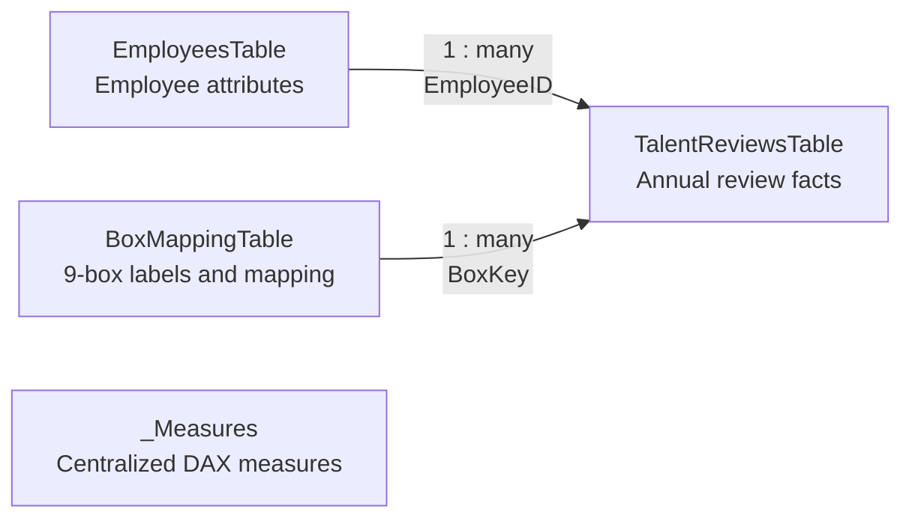

# Data model and implementation notes

## Model structure

The model separates employee attributes, annual review records, 9-box mappings, and calculations.

## Main tables

### EmployeesTable

One row per synthetic employee. Contains organizational context such as name, position, department, business unit, and manager.

### TalentReviewsTable

One row per employee and review period. Contains performance, potential, talent-position key, and movement-related fields.

### BoxMappingTable

Maps score combinations to 9-box names, labels, sort logic, and presentation attributes.

### _Measures

Dedicated home table for explicit DAX measures. Moving measures to this table improves discoverability without changing the analytical model.

## Modeling decisions

- Relationships are one-to-many and single-direction.
- Employee and review-period filters flow into annual review facts.
- Mapping logic is separated from employee review records.
- Measures use explicit filter-context handling instead of bidirectional relationships.
- Technical columns not intended for report authors are hidden.
- All employee counts use distinct EmployeeID where duplication could occur.

## Report design decisions

- Dynamic headlines communicate the main conclusion before supporting visuals.
- Each page focuses on one decision layer: distribution, movement, calibration, or department comparison.
- The 9-box is used for exploration, while employee context remains compact.
- Conditional color is reserved for meaningful analytical differences.
- Footnotes disclose comparison logic, thresholds, and interpretation limitations.

## Validation

- Measures were checked against the source workbook under multiple review-period and department filters.
- Movement pages exclude unsupported comparisons when no prior review exists.
- A model metadata query was used to verify that all explicit measures were valid and centralized in `_Measures`.
- The published report was tested without authentication using its public Power BI URL.
